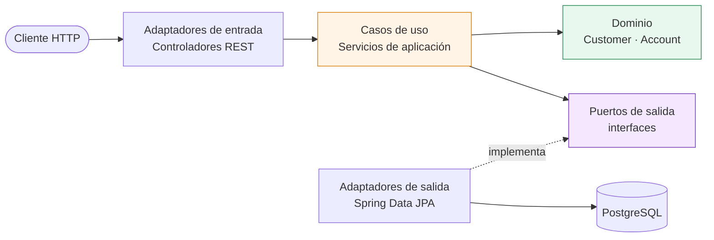
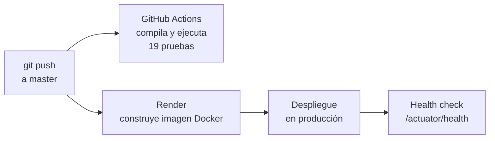

# Customer Account Service

[](https://github.com/DiegoAndreRodriguez/customer-account-service/actions/workflows/ci.yml)


Servicio REST para la gestión de **clientes** y **cuentas bancarias**, construido con **arquitectura hexagonal** (puertos y adaptadores). Implementa un CRUD completo con reglas de negocio propias del sector financiero: unicidad de datos de identidad, baja lógica para trazabilidad, generación de números de cuenta y validaciones cruzadas entre contextos.

## 🌐 Demo en vivo

**Swagger UI:** https://customer-account-service-eftt.onrender.com/swagger-ui.html

> Desplegado en el plan gratuito de Render: si el servicio lleva un rato sin uso, la primera petición puede tardar alrededor de un minuto mientras se reactiva.

## 📐 Documentación de diseño

| Documento | Contenido |
|---|---|
| [Diseño funcional](docs/01-diseno-funcional.md) | Alcance, actores, modelo de dominio, casos de uso, reglas de negocio y contrato de la API |
| [Diseño de componentes](docs/02-diseno-componentes.md) | Diagramas C4, arquitectura hexagonal, estructura de paquetes, flujos y decisiones de arquitectura |

## 🧰 Stack tecnológico

| Capa | Tecnología |
|---|---|
| Lenguaje | Java 25 (LTS) |
| Framework | Spring Boot 4.1 (Web MVC, Data JPA, Validation, Actuator) |
| Base de datos | PostgreSQL 16 |
| Migraciones | Flyway |
| Documentación de API | springdoc-openapi (OpenAPI 3.1 + Swagger UI) |
| Pruebas | JUnit 5, Mockito, AssertJ, MockMvc |
| Contenedores | Docker (imagen multi-etapa) + Docker Compose |
| CI | GitHub Actions |
| Nube | Render (servicio web + PostgreSQL gestionado) |

## 🏛️ Arquitectura

El dominio no depende de ningún framework. Define **puertos** (interfaces) con lo que necesita, y la infraestructura provee los **adaptadores** que los implementan. Las dependencias siempre apuntan hacia el núcleo.



El código está organizado **por contexto de negocio** y, dentro de cada uno, por capa:

```
com.diego.customeraccount
├── customer/
│   ├── domain/          → Customer, CustomerStatus, puertos
│   ├── application/     → CustomerService, DTOs
│   └── infrastructure/
│       ├── in/          → CustomerController
│       └── out/         → entidad JPA, repositorio, adaptador, mapper
├── account/
│   ├── domain/          → Account, AccountType, Currency, AccountStatus, puerto
│   ├── application/     → AccountService, AccountNumberGenerator, DTOs
│   └── infrastructure/
│       ├── in/          → AccountController
│       └── out/         → persistencia + ActiveAccountsAdapter
└── shared/
    ├── exception/       → excepciones de negocio y manejador global
    └── config/          → configuración de OpenAPI
```

**Comunicación entre contextos.** La regla RN-04 exige que el contexto de clientes sepa si un cliente tiene cuentas activas. En lugar de que `customer` dependa de `account`, el contexto de clientes declara el puerto `ActiveAccountsPort` y el contexto de cuentas lo implementa con `ActiveAccountsAdapter`. Así se evita el acoplamiento y la dependencia circular (principio de inversión de dependencias).

## 📋 Reglas de negocio

| ID | Regla | Respuesta |
|---|---|---|
| RN-01 | El número de documento (DNI) es único | `409` |
| RN-02 | El correo electrónico es único | `409` |
| RN-03 | No existe borrado físico: la baja cambia el estado a `INACTIVE` | — |
| RN-04 | No se puede inactivar un cliente con cuentas activas | `409` |
| RN-05 | El número de cuenta lo genera el sistema (`OOO-CC-NNNNNNNNN`) | — |
| RN-06 | Solo se abren cuentas a clientes existentes y activos | `404` / `409` |
| RN-07 | Toda cuenta nueva inicia con saldo `0.00`, nunca negativo | — |
| RN-08 | El DNI y el correo no se modifican tras el registro | — |

Los errores `409` por reglas de negocio incluyen el campo `ruleCode`, que referencia la regla del diseño funcional.

## 🔌 Endpoints

| Método | Ruta | Caso de uso |
|---|---|---|
| `POST` | `/api/v1/customers` | Registrar cliente |
| `GET` | `/api/v1/customers?page=0&size=20` | Listar clientes (paginado) |
| `GET` | `/api/v1/customers/{id}` | Consultar cliente |
| `PUT` | `/api/v1/customers/{id}` | Actualizar datos de contacto |
| `DELETE` | `/api/v1/customers/{id}` | Baja lógica de cliente |
| `POST` | `/api/v1/accounts` | Abrir cuenta |
| `GET` | `/api/v1/accounts/{id}` | Consultar cuenta |
| `GET` | `/api/v1/customers/{id}/accounts` | Listar cuentas de un cliente |
| `PATCH` | `/api/v1/accounts/{id}/status` | Cambiar estado de cuenta |

El detalle completo de cada contrato está en Swagger UI.

## 🚀 Ejecución local

### Opción A: todo con Docker (recomendada)

Solo necesitas Docker instalado.

```bash
git clone https://github.com/DiegoAndreRodriguez/customer-account-service.git
cd customer-account-service
docker compose up --build -d
```

Luego abre http://localhost:8080/swagger-ui.html

Para detenerlo: `docker compose down`

### Opción B: desarrollo desde el IDE

Requiere Java 25 y Docker. Levanta solo la base de datos y ejecuta la aplicación con Maven:

```bash
docker compose up -d postgres
./mvnw spring-boot:run
```

## 🧪 Pruebas

```bash
./mvnw test
```

La suite tiene **19 pruebas** en tres niveles:

| Nivel | Qué verifica | Herramientas |
|---|---|---|
| Unitarias de servicio | Reglas de negocio RN-01 a RN-07, con los puertos sustituidos por mocks | JUnit 5, Mockito |
| De controlador | Contrato HTTP: códigos de estado, validaciones, formato de error | MockMvc |
| De contexto | Arranque completo de la aplicación contra PostgreSQL | `@SpringBootTest` |

Gracias a la arquitectura hexagonal, las pruebas de reglas de negocio no necesitan base de datos y se ejecutan en milisegundos.

> La prueba de contexto requiere PostgreSQL disponible en `localhost:5432` (basta con `docker compose up -d postgres`).

## ⚙️ Configuración

La aplicación no contiene credenciales de entornos productivos: todo se inyecta por variables de entorno, con valores por defecto para desarrollo local.

| Variable | Descripción | Valor por defecto |
|---|---|---|
| `DB_URL` | URL JDBC de PostgreSQL | `jdbc:postgresql://localhost:5432/customer_account_db` |
| `DB_USERNAME` | Usuario de la base de datos | `admin` |
| `DB_PASSWORD` | Contraseña de la base de datos | `admin123` |
| `PORT` | Puerto HTTP | `8080` |

## 🔄 Integración y despliegue continuo



Cada push a `master` dispara el pipeline de pruebas en GitHub Actions y un despliegue automático en Render. Render verifica el endpoint de salud de Actuator antes de dirigir tráfico a la nueva versión.

## 🔭 Evolución futura

Fuera del alcance actual, de forma deliberada:

- **Movimientos y transferencias**, como un servicio independiente con control transaccional y de concurrencia.
- **Autenticación y autorización** con OAuth2 delegadas a un API Gateway.
- **Pruebas de integración con Testcontainers** para verificar la capa de persistencia contra PostgreSQL real.
- **Observabilidad** con métricas y trazas distribuidas.

## 👤 Autor

**Diego Andre Rodriguez** · [GitHub](https://github.com/DiegoAndreRodriguez)
