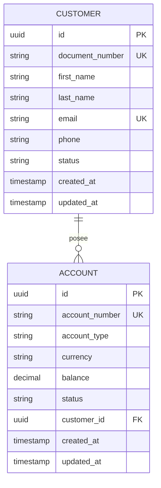
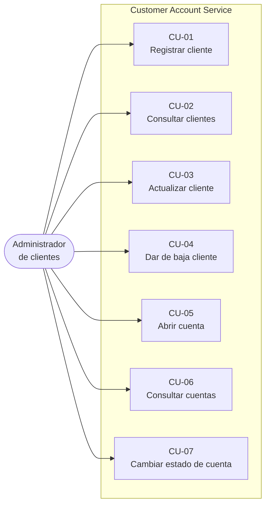

# Diseño Funcional — Customer Account Service

**Proyecto:** `customer-account-service`
**Autor:** Diego Andre Rodriguez
**Versión:** 1.0
**Fecha:** Septiembre 2026

---

## 1. Propósito

Este documento describe **qué hace** el sistema desde el punto de vista del negocio: qué problema resuelve, quiénes lo usan, qué información gestiona y bajo qué reglas. No describe cómo está construido internamente; eso se detalla en el [Diseño de Componentes](./02-diseno-componentes.md).

## 2. Contexto del negocio

Una entidad financiera necesita un servicio centralizado que administre la información de sus **clientes** y de las **cuentas bancarias** que estos poseen. Hoy esa información vive en sistemas distintos, lo que genera duplicidad de datos y dificulta mantener un dato maestro confiable del cliente.

El servicio expone una API REST para que otras aplicaciones del banco (banca por internet, aplicaciones de oficina, procesos batch) consulten y mantengan esta información desde un único origen de verdad.

## 3. Alcance

### Dentro del alcance

- Alta, consulta, actualización y baja lógica de clientes.
- Apertura, consulta y cambio de estado de cuentas bancarias.
- Validación de las reglas de negocio descritas en la sección 7.
- Documentación de la API mediante OpenAPI/Swagger.

### Fuera del alcance (evolución futura)

| Funcionalidad | Motivo de exclusión |
|---|---|
| Movimientos y transferencias entre cuentas | Requiere control transaccional y de concurrencia; se plantea como un servicio independiente. |
| Autenticación y autorización de usuarios | Se delegaría a un API Gateway con OAuth2 en un entorno productivo. |
| Cálculo de intereses y comisiones | Pertenece al dominio de productos, no al de datos maestros. |
| Integración con centrales de riesgo (SBS, Infocorp) | Depende de convenios externos. |

Esta delimitación es intencional: el objetivo es un dominio acotado y bien resuelto antes que uno amplio e incompleto.

## 4. Actores

| Actor | Descripción |
|---|---|
| **Administrador de clientes** | Usuario del banco (back office) que mantiene los datos maestros de clientes y cuentas. Es el actor principal del sistema. |
| **Sistemas consumidores** | Aplicaciones internas del banco que consultan información de clientes y cuentas vía API. |

## 5. Glosario (español ↔ inglés)

El código fuente está escrito en inglés siguiendo la convención estándar de la industria. Esta tabla establece la correspondencia con los términos de negocio en español.

| Término de negocio | Término en el código |
|---|---|
| Cliente | `Customer` |
| Cuenta | `Account` |
| Número de documento (DNI) | `documentNumber` |
| Nombres | `firstName` |
| Apellidos | `lastName` |
| Correo electrónico | `email` |
| Teléfono | `phone` |
| Estado | `status` |
| Número de cuenta | `accountNumber` |
| Tipo de cuenta | `accountType` |
| Moneda | `currency` |
| Saldo | `balance` |
| Cuenta de ahorros | `SAVINGS` |
| Cuenta corriente | `CHECKING` |
| Activo / Inactivo | `ACTIVE` / `INACTIVE` |

## 6. Modelo de dominio

### 6.1 Entidades

**Customer (Cliente)** — Persona natural registrada en el banco.

| Atributo | Tipo | Obligatorio | Descripción |
|---|---|---|---|
| `id` | UUID | Sí | Identificador único, generado por el sistema. |
| `documentNumber` | String(8) | Sí | DNI del cliente. Único en el sistema. |
| `firstName` | String(100) | Sí | Nombres del cliente. |
| `lastName` | String(100) | Sí | Apellidos del cliente. |
| `email` | String(150) | Sí | Correo electrónico. Único en el sistema. |
| `phone` | String(15) | No | Teléfono de contacto. |
| `status` | Enum | Sí | `ACTIVE` o `INACTIVE`. Por defecto `ACTIVE`. |
| `createdAt` | Timestamp | Sí | Fecha de registro. Generada por el sistema. |
| `updatedAt` | Timestamp | Sí | Fecha de última modificación. Generada por el sistema. |

**Account (Cuenta)** — Producto bancario asociado a un cliente.

| Atributo | Tipo | Obligatorio | Descripción |
|---|---|---|---|
| `id` | UUID | Sí | Identificador único, generado por el sistema. |
| `accountNumber` | String(14) | Sí | Número de cuenta. Generado por el sistema. Único. |
| `accountType` | Enum | Sí | `SAVINGS` (ahorros) o `CHECKING` (corriente). |
| `currency` | Enum | Sí | `PEN` (soles) o `USD` (dólares). |
| `balance` | Decimal(15,2) | Sí | Saldo actual. Inicia en `0.00`. |
| `status` | Enum | Sí | `ACTIVE` o `INACTIVE`. Por defecto `ACTIVE`. |
| `customerId` | UUID | Sí | Cliente propietario de la cuenta. |
| `createdAt` | Timestamp | Sí | Fecha de apertura. Generada por el sistema. |
| `updatedAt` | Timestamp | Sí | Fecha de última modificación. Generada por el sistema. |

### 6.2 Relación entre entidades

Un cliente puede tener **cero o muchas** cuentas. Toda cuenta pertenece **obligatoriamente** a un cliente.



## 7. Reglas de negocio

| ID | Regla | Respuesta ante incumplimiento |
|---|---|---|
| **RN-01** | El número de documento (DNI) debe ser único entre todos los clientes. | `409 Conflict` |
| **RN-02** | El correo electrónico debe ser único entre todos los clientes. | `409 Conflict` |
| **RN-03** | Ni clientes ni cuentas se eliminan físicamente. La baja consiste en cambiar el estado a `INACTIVE`, preservando el historial para auditoría y trazabilidad regulatoria. | — |
| **RN-04** | No se puede inactivar un cliente que tenga al menos una cuenta en estado `ACTIVE`. | `409 Conflict` |
| **RN-05** | El número de cuenta lo genera el sistema; nunca es proporcionado por el usuario. | — |
| **RN-06** | Una cuenta solo puede abrirse para un cliente existente y en estado `ACTIVE`. | `404 Not Found` / `409 Conflict` |
| **RN-07** | El saldo de una cuenta nueva siempre inicia en `0.00` y nunca puede ser negativo. | `400 Bad Request` |
| **RN-08** | El número de documento y el correo de un cliente no son modificables tras el registro, por tratarse de datos de identidad. Solo se actualizan nombres, apellidos y teléfono. | `400 Bad Request` |

**Formato del número de cuenta (RN-05):** 14 dígitos con la estructura `OOO-CC-NNNNNNNNN`, donde `OOO` es el código de oficina (fijo `001` en esta versión), `CC` identifica el tipo de cuenta y moneda, y `NNNNNNNNN` es un correlativo. Ejemplo: `00110000000123`.

## 8. Casos de uso



### CU-01 · Registrar cliente

> **Como** administrador, **quiero** registrar un nuevo cliente **para** poder ofrecerle productos bancarios.

| | |
|---|---|
| **Precondición** | El cliente no existe previamente en el sistema. |
| **Flujo principal** | 1. El administrador envía los datos del cliente. 2. El sistema valida el formato de los campos. 3. El sistema verifica que el DNI y el correo no estén registrados (RN-01, RN-02). 4. El sistema registra al cliente con estado `ACTIVE` y devuelve su identificador. |
| **Flujos alternativos** | 3a. El DNI o el correo ya existen → `409 Conflict`. 2a. Algún campo no cumple el formato → `400 Bad Request` con el detalle de los campos inválidos. |
| **Postcondición** | El cliente queda registrado y activo. |

### CU-02 · Consultar clientes

> **Como** administrador, **quiero** consultar el listado de clientes o el detalle de uno **para** revisar su información.

| | |
|---|---|
| **Flujo principal** | El sistema devuelve los clientes de forma paginada, o el detalle de uno por su identificador. |
| **Flujos alternativos** | El identificador no corresponde a ningún cliente → `404 Not Found`. |

### CU-03 · Actualizar cliente

> **Como** administrador, **quiero** actualizar los datos de contacto de un cliente **para** mantenerlos vigentes.

| | |
|---|---|
| **Precondición** | El cliente existe. |
| **Flujo principal** | El sistema actualiza nombres, apellidos y teléfono, y registra la fecha de modificación. |
| **Flujos alternativos** | Se intenta modificar el DNI o el correo → `400 Bad Request` (RN-08). El cliente no existe → `404 Not Found`. |

### CU-04 · Dar de baja un cliente

> **Como** administrador, **quiero** dar de baja a un cliente **para** dejar de gestionarlo sin perder su historial.

| | |
|---|---|
| **Precondición** | El cliente existe y no tiene cuentas activas. |
| **Flujo principal** | El sistema cambia el estado del cliente a `INACTIVE` (RN-03) y devuelve `204 No Content`. |
| **Flujos alternativos** | El cliente tiene al menos una cuenta activa → `409 Conflict` (RN-04). |
| **Postcondición** | El cliente permanece en la base de datos con estado `INACTIVE`. |

### CU-05 · Abrir una cuenta

> **Como** administrador, **quiero** abrir una cuenta para un cliente existente **para** que pueda operar.

| | |
|---|---|
| **Precondición** | El cliente existe y está activo. |
| **Flujo principal** | 1. El administrador indica el cliente, el tipo de cuenta y la moneda. 2. El sistema valida que el cliente exista y esté activo (RN-06). 3. El sistema genera el número de cuenta (RN-05). 4. El sistema registra la cuenta con saldo `0.00` y estado `ACTIVE`. |
| **Flujos alternativos** | El cliente no existe → `404 Not Found`. El cliente está inactivo → `409 Conflict`. |

### CU-06 · Consultar cuentas

> **Como** administrador, **quiero** consultar las cuentas de un cliente **para** conocer su situación financiera.

| | |
|---|---|
| **Flujo principal** | El sistema devuelve todas las cuentas asociadas al cliente indicado, o el detalle de una cuenta específica. |
| **Flujos alternativos** | El cliente o la cuenta no existen → `404 Not Found`. |

### CU-07 · Cambiar el estado de una cuenta

> **Como** administrador, **quiero** activar o inactivar una cuenta **para** bloquearla o reactivarla según lo requiera el cliente.

| | |
|---|---|
| **Precondición** | La cuenta existe. |
| **Flujo principal** | El sistema actualiza el estado de la cuenta y registra la fecha de modificación. |
| **Flujos alternativos** | La cuenta no existe → `404 Not Found`. Se envía un estado no válido → `400 Bad Request`. |

## 9. Especificación de la API REST

Todos los recursos se exponen bajo el prefijo `/api/v1`. El versionado en la ruta permite evolucionar el contrato sin romper a los consumidores existentes.

### 9.1 Recurso: Customers

| Método | Ruta | Descripción | Éxito |
|---|---|---|---|
| `POST` | `/api/v1/customers` | Registra un cliente | `201 Created` |
| `GET` | `/api/v1/customers` | Lista clientes (paginado) | `200 OK` |
| `GET` | `/api/v1/customers/{id}` | Obtiene un cliente | `200 OK` |
| `PUT` | `/api/v1/customers/{id}` | Actualiza datos de contacto | `200 OK` |
| `DELETE` | `/api/v1/customers/{id}` | Da de baja (lógica) | `204 No Content` |

### 9.2 Recurso: Accounts

| Método | Ruta | Descripción | Éxito |
|---|---|---|---|
| `POST` | `/api/v1/accounts` | Abre una cuenta | `201 Created` |
| `GET` | `/api/v1/accounts/{id}` | Obtiene una cuenta | `200 OK` |
| `GET` | `/api/v1/customers/{id}/accounts` | Lista las cuentas de un cliente | `200 OK` |
| `PATCH` | `/api/v1/accounts/{id}/status` | Cambia el estado de la cuenta | `200 OK` |

### 9.3 Ejemplos de contrato

**Registrar un cliente** — `POST /api/v1/customers`

```json
{
  "documentNumber": "71234567",
  "firstName": "Diego",
  "lastName": "Rodriguez",
  "email": "diego.rodriguez@example.com",
  "phone": "987654321"
}
```

Respuesta `201 Created`:

```json
{
  "id": "3f8a1c2e-9b4d-4e7a-8c1f-2d5b6a9e0f34",
  "documentNumber": "71234567",
  "firstName": "Diego",
  "lastName": "Rodriguez",
  "email": "diego.rodriguez@example.com",
  "phone": "987654321",
  "status": "ACTIVE",
  "createdAt": "2026-09-22T18:30:00",
  "updatedAt": "2026-09-22T18:30:00"
}
```

**Abrir una cuenta** — `POST /api/v1/accounts`

```json
{
  "customerId": "3f8a1c2e-9b4d-4e7a-8c1f-2d5b6a9e0f34",
  "accountType": "SAVINGS",
  "currency": "PEN"
}
```

Respuesta `201 Created`:

```json
{
  "id": "7d2e4f19-3a6b-4c8d-9e1f-0b2c3d4e5f60",
  "accountNumber": "00110000000123",
  "accountType": "SAVINGS",
  "currency": "PEN",
  "balance": 0.00,
  "status": "ACTIVE",
  "customerId": "3f8a1c2e-9b4d-4e7a-8c1f-2d5b6a9e0f34",
  "createdAt": "2026-09-22T18:35:00",
  "updatedAt": "2026-09-22T18:35:00"
}
```

### 9.4 Formato de error

Todas las respuestas de error comparten una estructura única, generada por un manejador global de excepciones:

```json
{
  "timestamp": "2026-09-22T18:40:12",
  "status": 409,
  "error": "CONFLICT",
  "message": "Ya existe un cliente registrado con el documento 71234567",
  "path": "/api/v1/customers"
}
```

Cuando el error corresponde a validaciones de formato, se incluye el detalle por campo:

```json
{
  "timestamp": "2026-09-22T18:41:05",
  "status": 400,
  "error": "BAD_REQUEST",
  "message": "Error de validación en los datos enviados",
  "path": "/api/v1/customers",
  "fieldErrors": [
    { "field": "documentNumber", "message": "debe tener exactamente 8 dígitos" },
    { "field": "email", "message": "debe ser una dirección de correo válida" }
  ]
}
```

### 9.5 Códigos de estado utilizados

| Código | Cuándo se devuelve |
|---|---|
| `200 OK` | Consulta o actualización exitosa. |
| `201 Created` | Recurso creado correctamente. |
| `204 No Content` | Baja lógica exitosa, sin cuerpo de respuesta. |
| `400 Bad Request` | Datos inválidos o violación de formato. |
| `404 Not Found` | El recurso solicitado no existe. |
| `409 Conflict` | Violación de una regla de negocio (duplicados, estados incompatibles). |
| `500 Internal Server Error` | Error no controlado. |

## 10. Requisitos no funcionales

| Requisito | Criterio |
|---|---|
| **Documentación** | La API se autodocumenta con OpenAPI 3 y expone Swagger UI en `/swagger-ui.html`. |
| **Observabilidad** | Endpoint de salud disponible en `/actuator/health` para las sondas de la plataforma de despliegue. |
| **Portabilidad** | La aplicación y su base de datos se levantan con un único comando mediante Docker Compose. |
| **Trazabilidad** | Toda entidad registra fecha de creación y de última modificación; ningún registro se elimina físicamente. |
| **Calidad** | Las reglas de negocio están cubiertas por pruebas unitarias automatizadas. |
| **Consistencia de datos** | El esquema de base de datos se versiona con Flyway, garantizando que todos los entornos partan del mismo estado. |

---

**Siguiente documento:** [Diseño de Componentes](./02-diseno-componentes.md)
