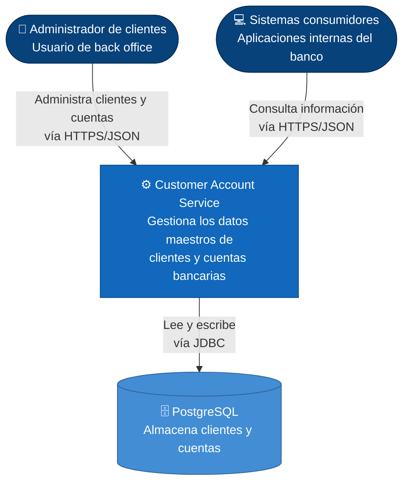
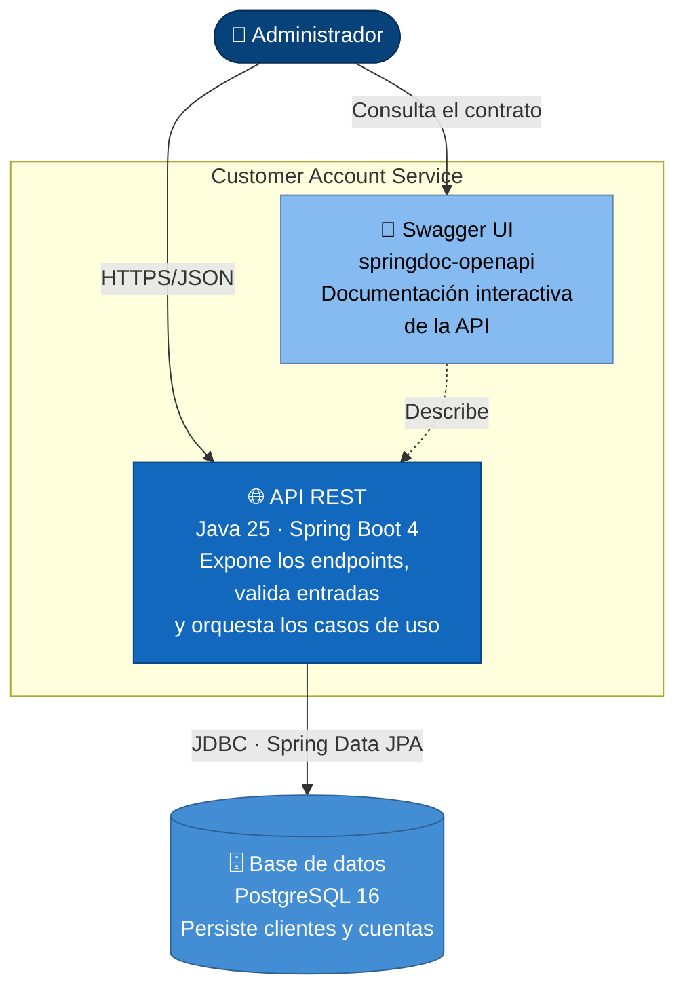
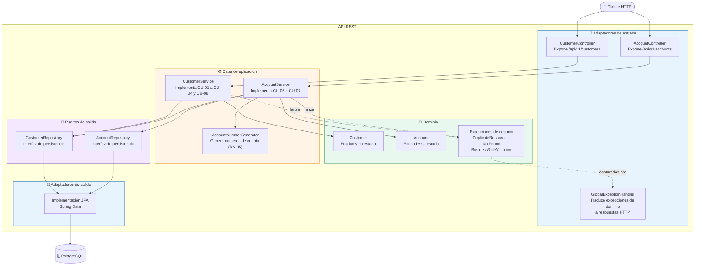
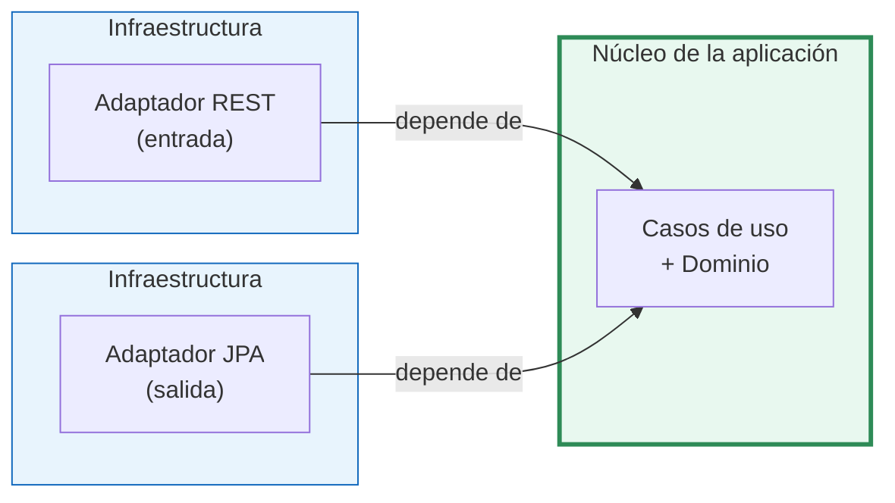
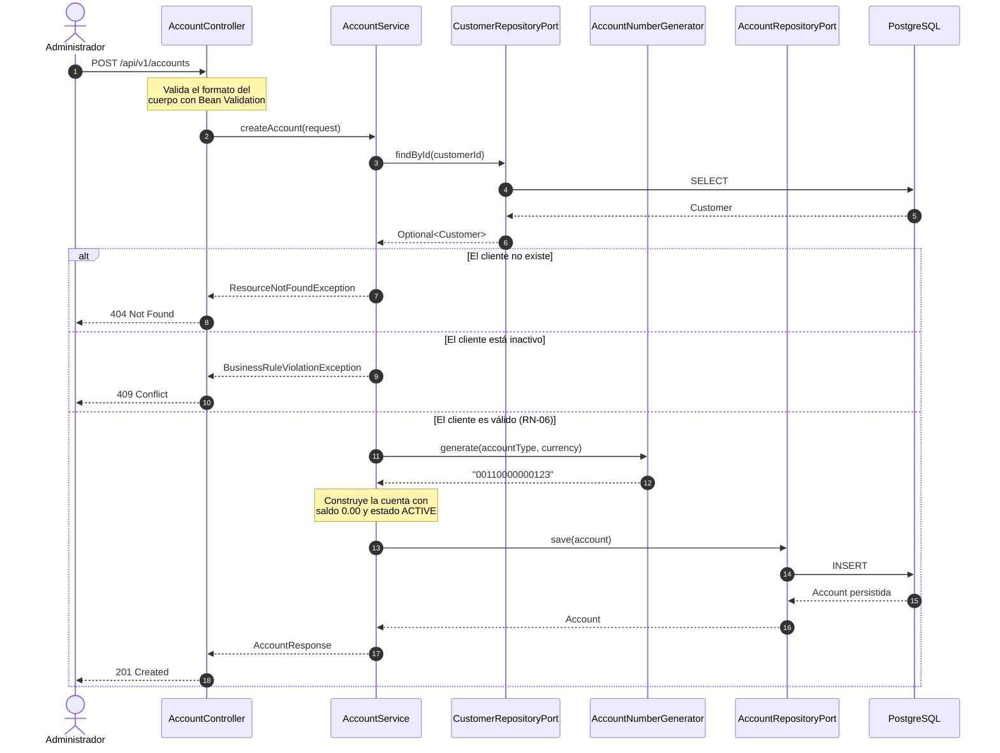
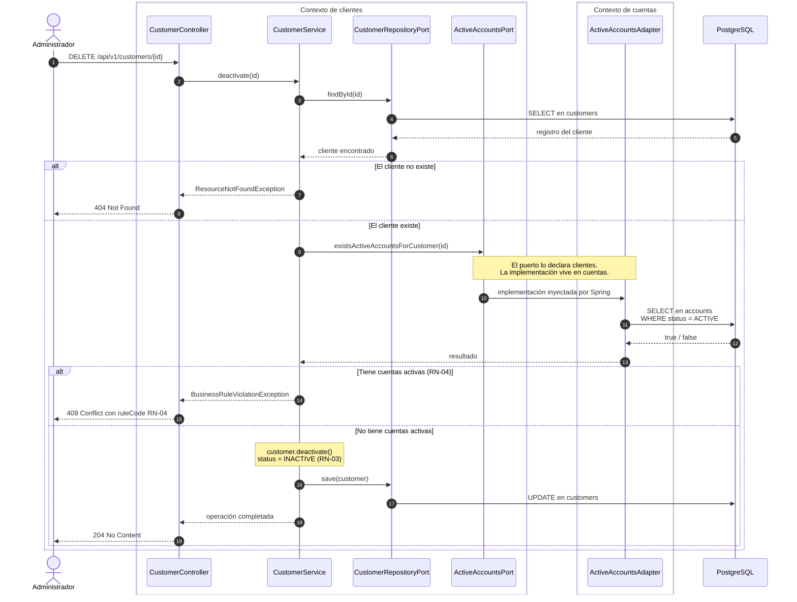
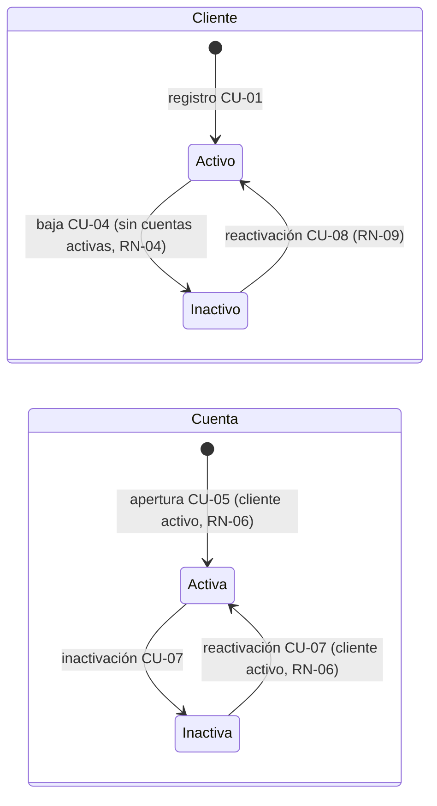
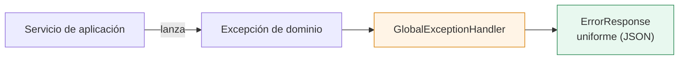
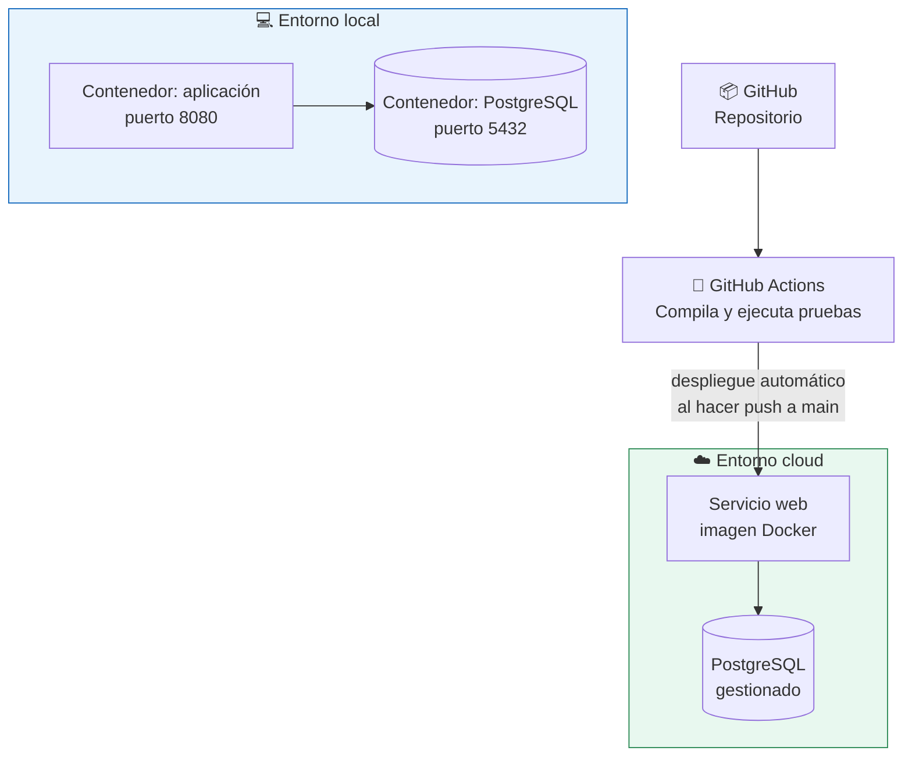

# Diseño de Componentes — Customer Account Service

**Proyecto:** `customer-account-service`
**Autor:** Diego Andre Rodriguez
**Versión:** 1.1
**Fecha:** Septiembre 2026

---

## 1. Propósito

Este documento describe **cómo está construido** el sistema: su estructura interna, la relación entre sus componentes y las decisiones de arquitectura que sustentan ese diseño. Complementa al [Diseño Funcional](./01-diseno-funcional.md), que define el comportamiento esperado.

La documentación sigue el **modelo C4** (Context, Containers, Components, Code), que permite describir la arquitectura en niveles de detalle progresivos: cada nivel hace *zoom* sobre el anterior.

## 2. Nivel 1 — Diagrama de Contexto

Este nivel responde a la pregunta *¿qué es el sistema y con quién interactúa?* Es la vista que se comparte con interlocutores no técnicos.



**Lectura del diagrama:** el servicio es un sistema autónomo que expone una API REST. No depende de otros sistemas del banco, lo que reduce el acoplamiento y permite desplegarlo de forma independiente. Su única dependencia externa es la base de datos.

## 3. Nivel 2 — Diagrama de Contenedores

Este nivel hace zoom dentro del sistema y muestra las **unidades desplegables** que lo componen y la tecnología de cada una.



### Tecnologías por contenedor

| Contenedor | Tecnología | Responsabilidad |
|---|---|---|
| **API REST** | Java 25 (LTS), Spring Boot 4.1, Spring Web | Recibe peticiones HTTP, valida, aplica reglas de negocio y responde. |
| **Persistencia** | PostgreSQL 16, Spring Data JPA, Flyway | Almacena de forma duradera los datos y versiona el esquema. |
| **Documentación** | springdoc-openapi | Genera el contrato OpenAPI 3 y la interfaz Swagger UI. |
| **Empaquetado** | Docker, Docker Compose | Permite levantar aplicación y base de datos de forma reproducible. |

## 4. Nivel 3 — Diagrama de Componentes

Este nivel hace zoom dentro del contenedor **API REST** y muestra sus componentes internos. Se aplica una **arquitectura hexagonal** (puertos y adaptadores), explicada en la sección 5.



### Responsabilidad de cada componente

| Componente | Responsabilidad | Lo que **no** hace |
|---|---|---|
| `CustomerController` / `AccountController` | Traducir HTTP a llamadas de negocio: deserializar el cuerpo, validar formato con Bean Validation y devolver el código de estado adecuado. | No contiene reglas de negocio ni consultas a base de datos. |
| `GlobalExceptionHandler` | Centralizar el manejo de errores y producir un formato de respuesta uniforme. | No decide reglas; solo traduce excepciones a códigos HTTP. |
| `CustomerService` / `AccountService` | Orquestar los casos de uso y hacer cumplir las reglas de negocio RN-01 a RN-09. | No conoce HTTP ni detalles de la base de datos. |
| `AccountNumberGenerator` | Construir el número de cuenta según el formato definido en RN-05. | No persiste nada. |
| `Customer` / `Account` | Representar las entidades del dominio y su estado válido. | No conocen la infraestructura. |
| `CustomerRepository` / `AccountRepository` | Definir el **contrato** de persistencia que necesita el dominio. | No implementan el acceso a datos; son interfaces. |
| Implementación JPA | Resolver el acceso real a PostgreSQL. | No contiene lógica de negocio. |

## 5. Decisión estructural: arquitectura hexagonal

### El problema que resuelve

En una arquitectura tradicional en capas, el servicio depende directamente del repositorio de JPA. Esa dependencia significa que la lógica de negocio queda atada al framework de persistencia: cambiar de base de datos, o probar la lógica sin levantar una, obliga a tocar el núcleo del sistema.

### La solución aplicada

La regla central es que **las dependencias siempre apuntan hacia el dominio**, nunca hacia afuera. El dominio define interfaces (*puertos*) que describen lo que necesita; la infraestructura provee las implementaciones (*adaptadores*).



### Beneficios concretos en este proyecto

| Beneficio | Manifestación práctica |
|---|---|
| **Testabilidad** | Las reglas de negocio se prueban con dobles de prueba (mocks) del repositorio, sin levantar PostgreSQL. Las pruebas corren en milisegundos. |
| **Independencia tecnológica** | Sustituir PostgreSQL por otra base de datos implica escribir un nuevo adaptador de salida; el dominio no cambia. |
| **Claridad de responsabilidades** | La ubicación de cada clase en la estructura de paquetes comunica su rol sin necesidad de leer su código. |
| **Evolución** | Añadir un adaptador de entrada adicional (por ejemplo, un consumidor de eventos) no requiere modificar los casos de uso existentes. |

### Coste asumido

El diseño introduce más clases e interfaces que una arquitectura en capas simple. Para un CRUD de dos entidades ese coste es apreciable, y en un proyecto real habría que evaluar si se justifica. Se adopta aquí porque el sistema está planteado como un servicio de datos maestros con vocación de crecer, y porque el sobrecoste inicial se paga una sola vez, mientras que el beneficio en testabilidad y aislamiento se cobra en cada cambio posterior.

## 6. Estructura de paquetes

La organización es **por contexto de negocio** (`customer`, `account`) y, dentro de cada uno, por capa. Esta disposición mantiene junto todo lo que cambia junto, y hace visibles las fronteras del dominio.

```
com.diego.customeraccount
│
├── customer/
│   ├── domain/
│   │   ├── model/
│   │   │   ├── Customer.java              → entidad de dominio
│   │   │   └── CustomerStatus.java        → enum ACTIVE / INACTIVE
│   │   └── port/
│   │       └── CustomerRepositoryPort.java → puerto de salida (interfaz)
│   │
│   ├── application/
│   │   ├── CustomerService.java           → casos de uso CU-01 a CU-04 y CU-08
│   │   └── dto/
│   │       ├── CreateCustomerRequest.java
│   │       ├── UpdateCustomerRequest.java
│   │       └── CustomerResponse.java
│   │
│   └── infrastructure/
│       ├── in/
│       │   └── CustomerController.java    → adaptador de entrada REST
│       └── out/
│           ├── CustomerJpaEntity.java     → entidad de persistencia
│           ├── CustomerJpaRepository.java → Spring Data JPA
│           ├── CustomerRepositoryAdapter.java → implementa el puerto
│           └── CustomerMapper.java        → dominio ↔ persistencia ↔ DTO
│
├── account/
│   ├── domain/
│   │   ├── model/
│   │   │   ├── Account.java
│   │   │   ├── AccountType.java           → enum SAVINGS / CHECKING
│   │   │   ├── Currency.java              → enum PEN / USD
│   │   │   └── AccountStatus.java         → enum ACTIVE / INACTIVE
│   │   └── port/
│   │       └── AccountRepositoryPort.java
│   │
│   ├── application/
│   │   ├── AccountService.java            → casos de uso CU-05 a CU-07
│   │   ├── AccountNumberGenerator.java    → regla RN-05
│   │   └── dto/
│   │       ├── CreateAccountRequest.java
│   │       ├── UpdateAccountStatusRequest.java
│   │       └── AccountResponse.java
│   │
│   └── infrastructure/
│       ├── in/
│       │   └── AccountController.java
│       └── out/
│           ├── AccountJpaEntity.java
│           ├── AccountJpaRepository.java
│           ├── AccountRepositoryAdapter.java
│           └── AccountMapper.java
│
├── shared/
│   ├── exception/
│   │   ├── ResourceNotFoundException.java
│   │   ├── DuplicateResourceException.java
│   │   ├── BusinessRuleViolationException.java
│   │   ├── GlobalExceptionHandler.java    → @RestControllerAdvice
│   │   ├── ErrorResponse.java
│   │   └── FieldErrorDetail.java
│   └── config/
│       └── OpenApiConfig.java             → metadatos de Swagger
│
└── CustomerAccountServiceApplication.java → punto de entrada
```

### Separación entre modelo de dominio y entidad de persistencia

`Customer` (dominio) y `CustomerJpaEntity` (persistencia) son clases distintas, relacionadas por un *mapper*. La alternativa —anotar la entidad de dominio con `@Entity`— es más breve, pero introduce en el núcleo una dependencia hacia JPA y condiciona el modelo de negocio a las restricciones del ORM. Mantenerlas separadas preserva la regla de dependencias descrita en la sección 5.

## 7. Flujo de una petición

El siguiente diagrama sigue el caso de uso **CU-05 · Abrir una cuenta**, que es el que más componentes atraviesa porque involucra ambos contextos de negocio.



Obsérvese que el servicio no conoce códigos HTTP: lanza excepciones de dominio y es el `GlobalExceptionHandler` quien las traduce. Esta separación permite reutilizar los casos de uso desde un adaptador de entrada distinto sin arrastrar semántica web.


### 7.2 CU-04 · Dar de baja un cliente (flujo entre contextos)

Este flujo aplica la regla RN-04, que obliga al contexto de clientes a conocer el estado de las cuentas. El contexto de clientes declara el puerto `ActiveAccountsPort` y el contexto de cuentas lo implementa; en tiempo de ejecución, Spring inyecta el adaptador. Así, `customer` nunca importa código de `account`.



Los recuadros agrupan a cada participante según el contexto al que pertenece. La única flecha que cruza de un recuadro al otro pasa por el puerto, nunca por una clase concreta.

### 7.3 Ciclo de vida de clientes y cuentas

Los estados de ambas entidades se condicionan mutuamente: el estado de las cuentas decide si un cliente puede darse de baja (RN-04), y el estado del cliente decide si una cuenta puede abrirse o reactivarse (RN-06).



Un cliente que regresa al banco sigue este recorrido: actualiza sus datos de contacto, se reactiva, y luego reactiva sus cuentas anteriores o abre nuevas.

## 8. Modelo de datos y versionado del esquema

El esquema se crea mediante migraciones de **Flyway**, no con la generación automática de Hibernate (`ddl-auto`). Las migraciones son archivos SQL versionados que se ejecutan en orden y quedan registrados en la tabla `flyway_schema_history`.

```
src/main/resources/db/migration/
├── V1__create_customers_table.sql
└── V2__create_accounts_table.sql
```

| Criterio | Flyway | `ddl-auto=update` |
|---|---|---|
| Reproducibilidad entre entornos | Garantizada: todos parten del mismo script. | No garantizada: depende del estado previo. |
| Control sobre el cambio | Explícito y revisable en el repositorio. | Implícito, decidido por Hibernate. |
| Viabilidad en producción | Es la práctica estándar. | Desaconsejada por riesgo de pérdida de datos. |

En el perfil de pruebas se utiliza **H2** en memoria, lo que permite ejecutar la suite sin depender de una base de datos externa.

## 9. Manejo de errores

El manejo de errores está centralizado en un único punto mediante `@RestControllerAdvice`. Ningún controlador captura excepciones por su cuenta.



| Excepción | Código HTTP | Situación que la origina |
|---|---|---|
| `ResourceNotFoundException` | `404` | El identificador solicitado no existe. |
| `DuplicateResourceException` | `409` | Violación de RN-01 o RN-02 (DNI o correo duplicado). |
| `BusinessRuleViolationException` | `409` | Violación de RN-04, RN-06 o RN-09. |
| `MethodArgumentNotValidException` | `400` | Falla la validación de formato de Bean Validation. |
| `Exception` (genérica) | `500` | Error no previsto; se registra en el log sin exponer detalles internos al cliente. |

## 10. Estrategia de pruebas

| Nivel | Alcance | Herramientas |
|---|---|---|
| **Unitarias de servicio** | Reglas de negocio RN-01 a RN-09, con los puertos sustituidos por mocks. Es el nivel donde se concentra el mayor valor. | JUnit 5, Mockito |
| **De controlador** | Contrato HTTP: códigos de estado, serialización y validación de entrada. | `@WebMvcTest`, MockMvc |
| **De contexto** | Verificación de que la aplicación arranca y el cableado de dependencias es correcto. | `@SpringBootTest` con perfil `test` y H2 |

Las pruebas se ejecutan automáticamente en cada `push` mediante GitHub Actions.

## 11. Vista de despliegue



La aplicación no contiene credenciales en el código: la configuración sensible se inyecta como variables de entorno, lo que permite que el mismo artefacto —la imagen Docker— se promueva sin modificaciones entre entornos.

## 12. Registro de decisiones de arquitectura

| # | Decisión | Alternativa descartada | Fundamento |
|---|---|---|---|
| 1 | Arquitectura hexagonal | Arquitectura en capas | Aísla el dominio del framework y habilita pruebas sin infraestructura. |
| 2 | Organización por contexto de negocio | Organización por capa técnica | Mantiene junto lo que cambia junto y hace visibles las fronteras del dominio. |
| 3 | Modelo de dominio separado de la entidad JPA | Entidad única anotada con `@Entity` | Evita que las restricciones del ORM condicionen el modelo de negocio. |
| 4 | Flyway para el esquema | `ddl-auto` de Hibernate | Reproducibilidad y control explícito del cambio; es lo admisible en producción. |
| 5 | Baja lógica en lugar de borrado físico | `DELETE` en base de datos | Trazabilidad y cumplimiento de requisitos de auditoría del sector financiero. |
| 6 | Versionado de la API en la ruta (`/api/v1`) | Versionado por cabecera | Más explícito y sencillo de consumir; visible en la documentación y en los logs. |
| 7 | Java 25 (LTS) | Java 26 | Las versiones LTS reciben soporte extendido; es el criterio habitual en entornos corporativos. |
| 8 | UUID como identificador | Entero autoincremental | Evita exponer el volumen de registros y facilita la integración entre sistemas. |

---

**Documento anterior:** [Diseño Funcional](./01-diseno-funcional.md)
